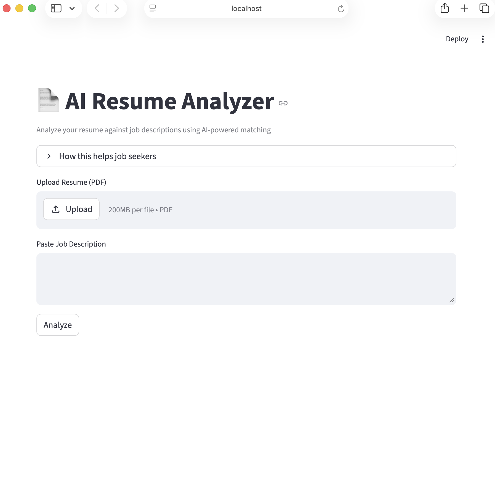
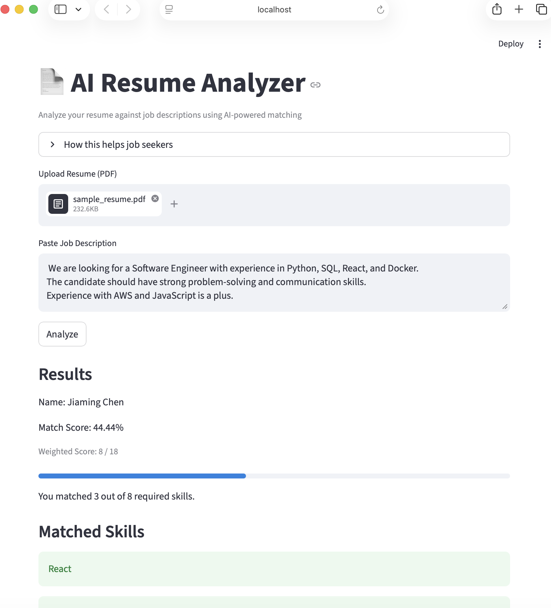
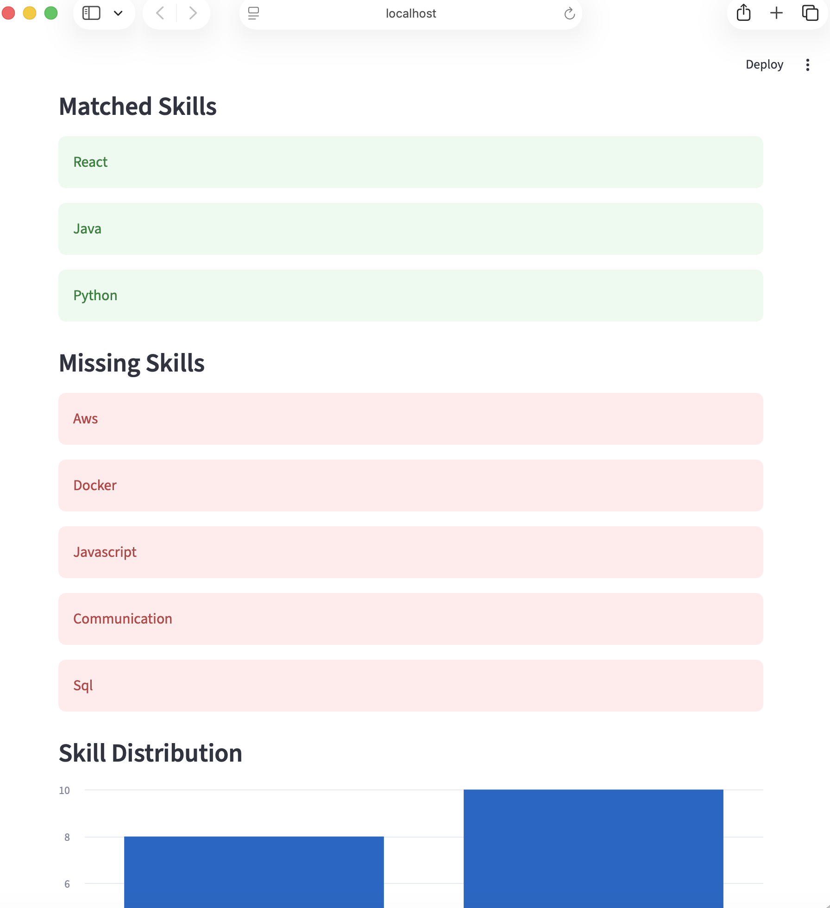
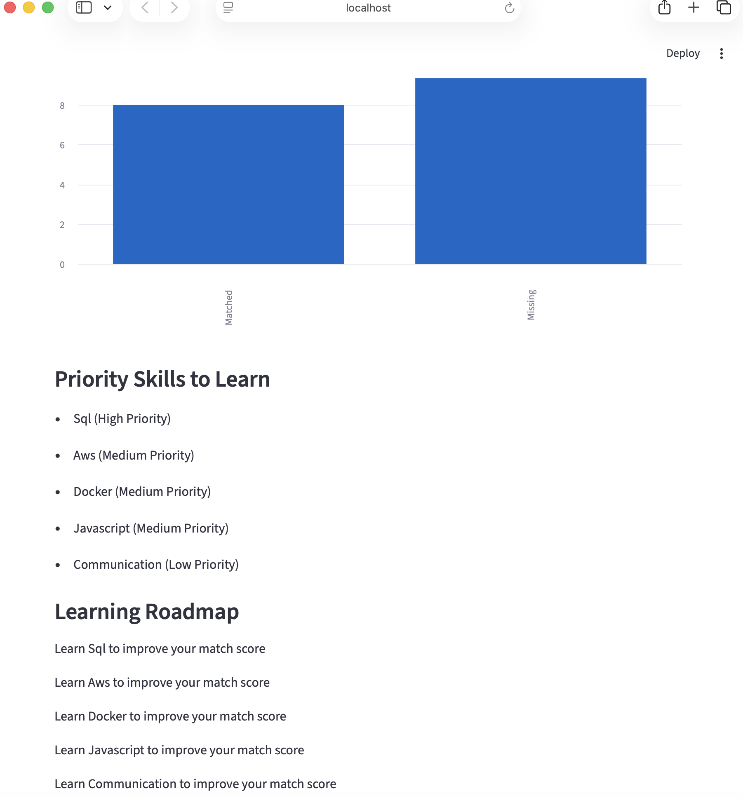
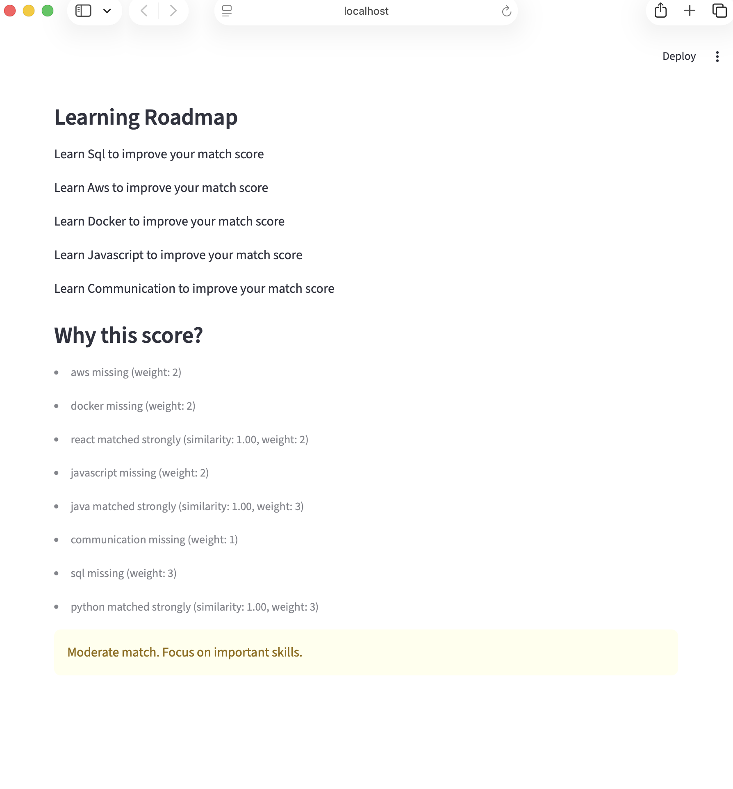

# 📄 AI Resume Analyzer

## Overview
AI-powered Resume Analyzer that compares a candidate’s resume with a job description to evaluate skill match and identify gaps.

This project uses NLP techniques and semantic similarity to provide a more intelligent comparison than simple keyword matching.

---

## Features
- Upload PDF resume
- Extract name and skills using NLP (spaCy)
- Analyze job description
- Semantic skill matching using Sentence Transformers
- Weighted scoring system
- Visual insights and recommendations

---

## How It Works
1. Extract text from resume (PDF)
2. Identify skills using NLP
3. Parse job description for required skills
4. Convert skills into embeddings
5. Compare using cosine similarity
6. Generate:
   - Match score
   - Matched skills
   - Missing skills
   - Recommendations

---

## Tech Stack
- Python
- Streamlit
- spaCy
- Sentence Transformers
- scikit-learn

---

## Example Output
- Match Score: 65%
- Matched Skills: Python, React
- Missing Skills: SQL, Docker
- Recommendation: Focus on SQL and Docker to improve job fit

---

## Application Preview

### Input Interface

### Results Overview

### Detailed Results

### Additional Insights

### Explanation Interface

---

## Limitations
- Relies on predefined skill list
- Rule-based + embedding hybrid approach
- Not fully generalized NLP system

---

## Future Improvements
- Dynamic skill extraction using advanced NLP
- Better UI/UX design
- Deploy as a live web app

---

## Why This Project
This project demonstrates:
- NLP-based data extraction
- Semantic similarity modeling
- System design thinking
- Building end-to-end applications

---